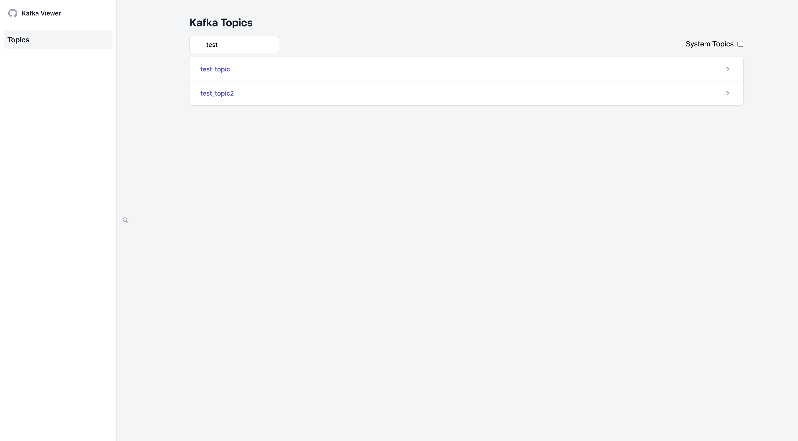
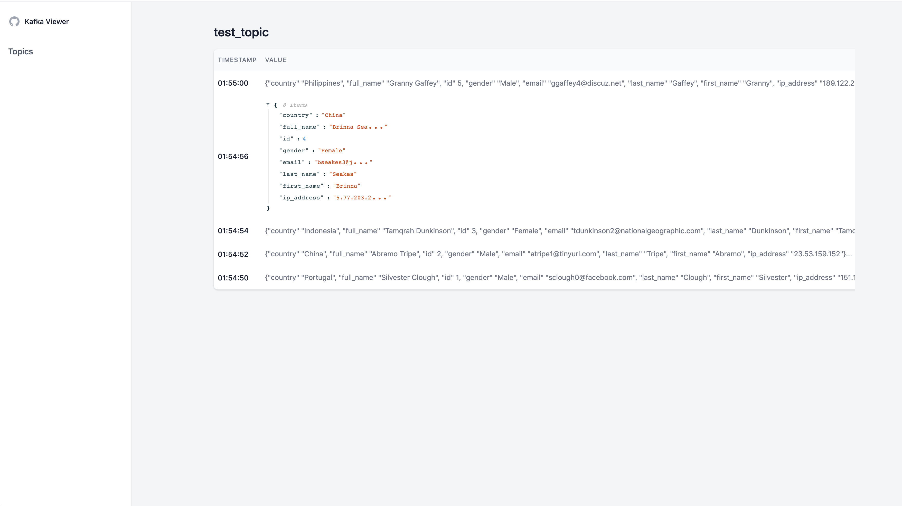

# Kafka Viewer

Browse kafka topics

- list topics
- tail topic message
  - json format only

(This project was created to learn `Clojure`)

###### Screenshots

view topics


view topic message


## Build

```bash
lein uberjar
```

## Run

- BOOTSTRAP_SERVERS: comma-separated list of host and port pairs that are the addresses of the Kafka brokers
- PORT: web server port

```bash
export BOOTSTRAP_SERVERS="localhost:9092"
export PORT=8080

java -jar kafka-viewer.jar
```


## License

The MIT License  
http://opensource.org/licenses/MIT
